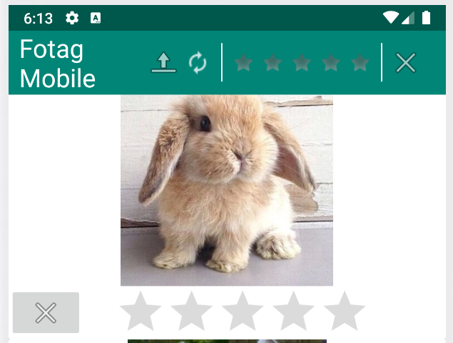
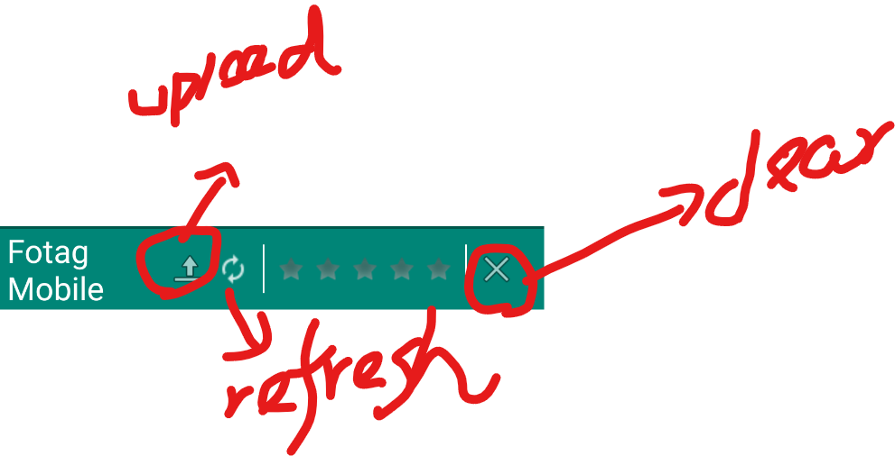
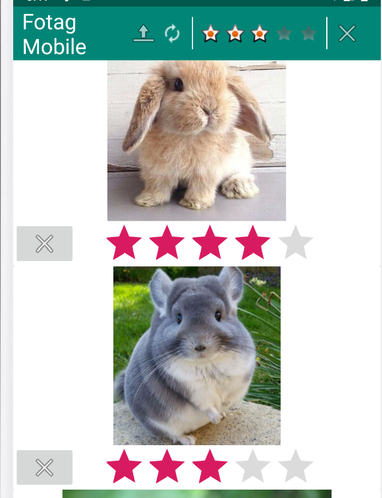
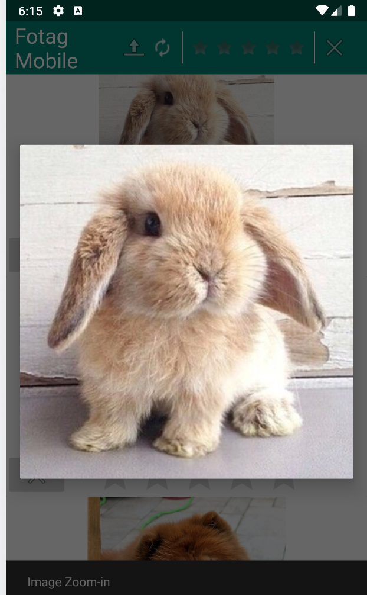

## Fotag implemented with RecyclerView/Cardview
A Album Viewer that allow user to load/rate/filter image from online resource

## Prerequisite
- Grade needs to be installed 
- Android SDK API 28 
- Emulator: Pixel (Google Phone) AVD using API 28

## Reference
- All images are from default Android given library 
- "refresh.png" is from `www.iconstudents.com/`
- Some config setting and online image loading are from Piazza/ Android official guidline

## Basic Operation

All Commands are on the Top Bar. There are three main ones.

- `load button`: **Upload** 10 images from online resource and **clear all current setting**
    - Current Rating will be cleared
    - Filter Rating will be cleared 
    - All images will be shown
    
- `Refresh(clear filter) button`: **Reset** the current filter to 0
    - "You should support filtering by **"any"** image"
    - All images will be kept
    - filter will be set to 0
    
- `filter widget`: 5 stars as current filter. 
    - Showing images with star >= current filter

    
- `destroy button`: all images will be cleared 
    - filter will be set to 0

### Individual Card

- Rank individual image to 1 - 5 star
- Clicking the button aside RatingBar will set the corresonding image unrated(**0 Star**).

## Application-wise Support

### Zoom-in
- Clicking the image will create a new pop-up dialog

    - Clicking image again will go back to the main activity

### Rotation

- Rotate the device will make 2-columns in the viewer
- Portrait orientation will be 1-column in the viewer

## Advantage Bonus Point

- Recycler view is more efficient than gridview. It allows android to not load iamge when you scroll to that sccific location. This is preferred in large APP design
- CardView achieves scalable and elegant arrangement for all elements loaded to the app.
    - All components(rating,image) are bound to package together 

